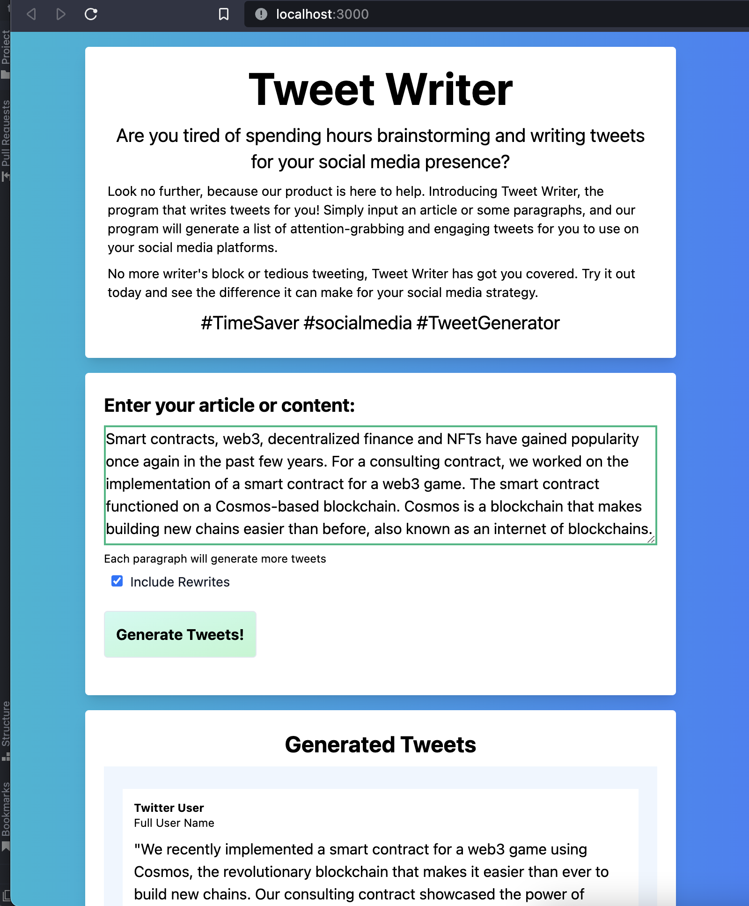

# Tweet Writer

Given an article or some paragraphs, this program will write a list of tweets for you.

Requires an OpenAI API key: https://beta.openai.com/account/api-keys


Copyright (C) 2022 Rudolf Olah <rudolf.olah.to@gmail.com>

Licensed under the MIT license: [LICENSE](./LICENSE)

## Usage

Set up your `.env` file:

```
OPEN_AI_API_KEY="api goes here"
SERVER_PORT=3000
```

```bash
npm install
npm start
```

## Development

The web pages use React with the Semi UI framework.

To update the web user interface, go to `webui`. To run the web user interface in a development web server, use `npm run start`

To update the server code, check out `index.js`


